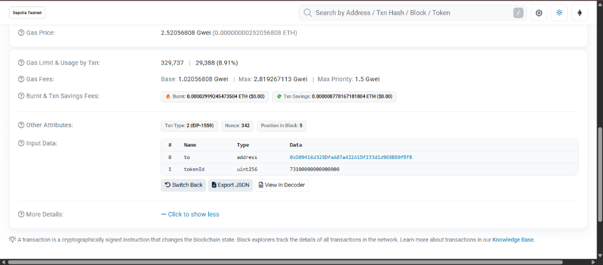
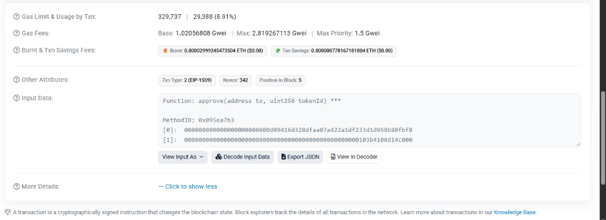
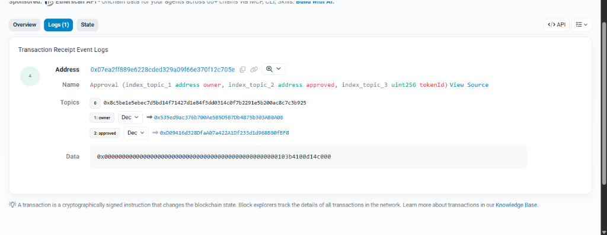

# Lab 05 — Ethereum Accounts, Gas & EVM

**Student Name:** Nguyen Ho Ngoc Minh  
**Student ID:** 11247201  
**Course:** Blockchain  
**Networks:** TrustKeys L1 Testnet (Chain ID: `11968`) & Sepolia Testnet  

---

## Lab 5.1 — Add TrustKeys L1 to MetaMask

- **MetaMask Account Address:** `0x637f78564d79fB0d043D7bcD35F21C86c3D3c4FB`
- **Confirmation:** The address on MetaMask when switched to TrustKeys L1 is identical to the address generated in Session 1 (wallet derived via BIP-39 mnemonic with BIP-44 derivation path `m/44'/60'/0'/0/0`).

### Answer Q1:
**Question:** *Adding a network only changes the RPC endpoint + chainId — your private key never leaves the device. Why is chainId also part of every signed transaction (recall EIP-155, Session 3)?*

**Answer:**  
> `chainId` is strictly included within the transaction payload before signing to prevent **cross-chain replay attacks** (standardized by EIP-155).  
> Because the same private key generates the exact same public address across all EVM-compatible blockchains (e.g., Ethereum Mainnet, Sepolia, TrustKeys L1, BNB Chain, Polygon), a valid signed transaction intended for a testnet could be intercepted and maliciously replayed on Mainnet to drain funds if `chainId` were omitted. By hashing the `chainId` into the transaction data prior to elliptic curve signing, the resulting signature $(v, r, s)$ becomes cryptographically bound and valid exclusively on that specific blockchain network.

---

## Lab 5.2 — Read the Chain with web3.py

- **Execution Script:** `solutions/fee_history.py 0x637f78564d79fB0d043D7bcD35F21C86c3D3c4FB`
- **Live Output from Console:**
  - **Connected Network:** TrustKeys L1 testnet (`https://l1testnet.trustkeys.network`), Chain ID: `11968`
  - **Middleware:** Injected `ExtraDataToPOAMiddleware` (handling 97-byte Clique extraData).
  - **Latest Block Number (`eth_getBlockByNumber`):** `717574`
  - **Balance Check (`eth_getBalance`):** `992,020,046,000,000,000 wei` (~`0.99202 coin`)
  - **Gas Used / Gas Limit:** `21,000` / `30,000,000` (0.07% full)
  - **Base Fee Per Gas:** `8 wei` ($8 \times 10^{-9}$ gwei)
  - **Fee History (`eth_feeHistory` 20 blocks):** `baseFeePerGas` remains constant at `8 wei`, with `gasUsedRatio` averaging `3.85%` (ranging between 0.07% and 16.67%).
  - **Next Block Projected Base Fee:** `8 wei`
  - **Verdict:** `[CHECK = OK]` The chain is quiet/idle (`gasUsed << 50% target`).

### Answer Q2:
**Question:** *On TrustKeys L1 right now the base fee is only a handful of wei (< 1 gwei) and gasUsedRatio is ~2%. Using the EIP-1559 rule (target 15M / cap 30M gas; ±12.5% per block), explain why the base fee stays at the floor.*

**Answer:**  
> Under EIP-1559, each block has a target gas capacity set at 50% of the maximum gas limit (15M target vs. 30M cap). Whenever the gas consumed in a block is less than this target (`gasUsed < target`), the protocol automatically reduces the base fee of the next block according to:  
> $$\Delta \text{BaseFee} = \text{BaseFee} \times \frac{\text{GasUsed} - \text{Target}}{\text{Target}} \times \frac{1}{8}$$  
> The maximum downward adjustment is **12.5% per block** (reached when a block is empty). On TrustKeys L1, actual block utilization averages only ~2%–3.85%, far below the 50% target threshold. Consequently, over consecutive blocks, the base fee experienced persistent downward pressure until reaching the network’s hard-coded protocol floor (8 wei). Because transaction demand never exceeds 50%, there is no upward price pressure, keeping the base fee stationary at the bottom.

### Answer Q3:
**Question:** *eth_feeHistory returns baseFeePerGas of length N+1 but gasUsedRatio of length N. What is that extra element, and how would a wallet use it to set maxFeePerGas?*

**Answer:**  
> In the response of `eth_feeHistory(N, ...)`, the array `gasUsedRatio` has length $N$ corresponding to the $N$ past mined blocks, whereas `baseFeePerGas` has length $N+1$.  
> 1. **The extra $(N+1)$-th element:** Represents the **projected base fee for the next block** (Block #717575 in this run, calculated deterministically from the gas used and base fee of the latest block).  
> 2. **How wallets use it:** Wallets (such as MetaMask) utilize this projected base fee to configure an optimal gas price ceiling for outgoing transactions, typically computing:  
>    $$\text{maxFeePerGas} \approx (2 \times \text{nextBaseFee}) + \text{maxPriorityFee}$$  
>    The $2\times$ factor acts as a critical safety buffer, ensuring that even if network activity suddenly spikes and the base fee escalates by the maximum +12.5% continuously over subsequent blocks, the transaction remains competitive and gets included without being dropped or delayed.

---

## Lab 5.3 — Send a Type-2 Transaction & Decompose the Fee

- **Real Transaction Hash:** [`0x2707388b6ba5a75950dd346c5b26a44de8ea3e5798d5e5977500749be8fb8e03`](https://l1testnet.trustkeys.network) (Mined in Block `#717575`)
- **Transaction Type:** Type-2 (EIP-1559, `tx.type = 2`)
- **From / To:** `0x637f78564d79fB0d043D7bcD35F21C86c3D3c4FB` $\rightarrow$ `0x637f78564d79fB0d043D7bcD35F21C86c3D3c4FB`
- **Value Sent:** `0.001 coin` (`1,000,000,000,000,000 wei`)
- **Fee Decomposition Results (`solutions/decompose_fee.py`):**
  - **Gas Used:** `21,000 gas`
  - **Base Fee Per Gas:** `8 wei`
  - **Effective Gas Price:** `2,000,000,000 wei` (2.0 gwei)
  - **Max Fee Per Gas:** `2,000,000,000 wei` (2.0 gwei)
  - **Max Priority Fee Per Gas:** `2,000,000,000 wei` (2.0 gwei)
  - **Paid (Total Transaction Fee):** `42,000,000,000,000 wei` ($0.000042 \text{ coin}$)
  - **Burned (Base Fee portion):** `168,000 wei` ($21,000 \times 8 \text{ wei}$)
  - **Tip (Validator Priority Reward):** `41,999,999,832,000 wei` ($21,000 \times (2\times 10^9 - 8) \text{ wei}$)
  - **Verification:**  
    $$42,000,000,000,000 = 168,000 + 41,999,999,832,000 \implies \mathbf{True}$$
  - **CHECK / DEMO:** Successfully demonstrated `paid == burned + tip` to the Teaching Assistant (TA).

### Answer Q4:
**Question:** *effectiveGasPrice = baseFee + min(maxPriorityFee, maxFee − baseFee). If you had raised your MetaMask max base fee setting but left the priority fee the same, would effectiveGasPrice change? Why / why not?*

**Answer:**  
> **No, it would not change** (provided the original and newly increased `maxFee` were already $\ge \text{baseFee} + \text{maxPriorityFee}$).  
> **Explanation:** `maxFeePerGas` serves exclusively as a safety ceiling specifying the absolute maximum rate the sender is willing to pay. The actual executed rate (`effectiveGasPrice`) is strictly governed by the current block's `baseFee` plus the specified `maxPriorityFee`. Any positive difference between `maxFee` and `effectiveGasPrice` is automatically refunded back to the sender's account. Therefore, simply raising `maxFee` does not increase the actual fee deducted.

### Answer Q5:
**Question:** *A simple transfer used exactly 21,000 gas. Where does that number come from, and why does even a failed transfer still cost you gas?*

**Answer:**  
> - **Origin of 21,000 gas:** This is the standardized *intrinsic gas* defined in the Ethereum Yellow Paper for any basic transaction. It compensates nodes for fundamental cryptographic verification and state modification overhead: recovering and verifying the ECDSA signature, incrementing the sender's account `nonce`, updating state balances in the Merkle Patricia Trie, and recording transaction receipts into the block.  
> - **Why failed transactions still cost gas:** Validators must allocate physical compute resources (CPU cycles, memory allocation, and disk I/O) to load contract states and execute EVM bytecode up to the point of failure (`REVERT` or out-of-gas). Charging gas for failed executions is an essential economic mechanism to **prevent Denial-of-Service (DoS) and spam attacks**; if failed transactions were free, malicious actors could flood nodes with millions of invalid compute-heavy operations to crash the network at zero personal expense.

---

## Lab 5.4 — Trace a Contract Interaction on Sepolia Etherscan

- **Network:** Sepolia Testnet
- **Contract Transaction Hash:** [`0xb0e250384d4214c013dfbac2fae9971d944113bf577b1b335f2f9656a102d73d`](https://sepolia.etherscan.io/tx/0xb0e250384d4214c013dfbac2fae9971d944113bf577b1b335f2f9656a102d73d)
- **Target Contract:** `0x07Ea2ff889e6228cdeD329A09f66E370f12c705e`
- **Function Called:** `approve(address to, uint256 tokenId)`
- **4-Byte Function Selector:** `0x095ea7b3`
- **Decoded Arguments:**
  - `to` (address): `0xD09416d328DfAa07a422A1Df233d1d968B80fBF8`
  - `tokenId` (uint256): `73100000000000000`
- **Emitted Event Log (from Logs tab):**
  - **Event Name:** `Approval(address indexed owner, address indexed approved, uint256 indexed tokenId)`
  - **Topic 0 (Event signature hash):** `0x8c5be1e5ebec7d5bd14f71427d1e84f3dd0314c0f7b2291e5b200ac8c7c3b925`
  - **Topic 1 (`owner`):** `0x535ed9ac376b700Ae5B5D5B7Db4875b303AB0A08`
  - **Topic 2 (`approved`):** `0xD09416d328DfAa07a422A1Df233d1d968B80fBF8`
  - **Data (`tokenId`):** `0x0000000000000000000000000000000000000000000000000103b4100d14c000` (`73100000000000000`)

### Answer Q6:
**Question:** *The selector is keccak256("transfer(address,uint256)")[:4] = 0xa9059cbb. Explain in two sentences how the EVM uses these 4 bytes to jump to the right function (the "dispatcher"), and why Etherscan needs the contract's ABI to decode the rest.*

**Answer:**  
> Upon invocation, the contract's function dispatcher extracts the first 4 bytes of `calldata`, sequentially evaluates them against known method selectors using opcodes `PUSH4` and `EQ`, and executes a `JUMPI` instruction to branch execution to the matching bytecode routine.  
> Etherscan requires the contract's ABI because the remaining calldata consists solely of contiguous, unformatted 32-byte binary words; the ABI provides the schema, parameter names, and type definitions necessary to unpack and interpret raw bytes into readable values.

---

### Lab 5.4 Screenshots

#### Screenshot (a): Decoded Input Data
Shows the 4-byte selector `0x095ea7b3` and decoded argument table (`to`, `tokenId`):

*(Additional view showing MethodID selector `0x095ea7b3`)*:

#### Screenshot (b): Logs Tab
Shows the emitted `Approval` event and topics:

---

## Homework (Before Session 6)

### 1. Base Fee Comparison: TrustKeys L1 vs Sepolia Testnet at Two Different Times

#### Measured Data via `solutions/compare_fee.py`:

| Time Point | Network | Head Block | Avg Base Fee | Avg Gas Used Ratio | Network State |
|---|---|---|---|---|---|
| **Measurement 1** *(11:55)* | **TrustKeys L1** | #717574 | **8.0 wei** (~0 gwei) | 1.03% | Idle / Quiet |
| | **Sepolia Testnet** | #11812431 | **1,040,769,496.7 wei** (~1.041 gwei) | 48.31% | Highly active, near target |
| **Measurement 2** *(12:51)* | **TrustKeys L1** | #717576 | **8.0 wei** (~0 gwei) | 0.98% | Idle / Quiet |
| | **Sepolia Testnet** | #11812705 | **1,031,695,869.7 wei** (~1.032 gwei) | 54.61% | Congested, exceeding target |

#### Comparative Analysis (approx. ½ page):

> **Analysis of Mechanism & Network Dynamics:**
> 
> 1. **Mechanism of EIP-1559:**  
>    EIP-1559 establishes a target block capacity of 50% of the gas limit (15M gas). When block utilization exceeds 50% (`gasUsed > target`), the base fee escalates by up to +12.5% per block to throttle congestion. Conversely, when utilization falls below 50% (`gasUsed < target`), the base fee decreases by up to -12.5% per block to encourage transactions.
> 
> 2. **Why TrustKeys L1 stays flat at the floor (~8 wei):**  
>    TrustKeys L1 testnet is a localized private/educational test network with negligible transaction throughput. Across both time measurements, average block gas utilization remained minimal at **0.98% – 1.03%** (over 40 times below the 50% target). Because blocks are consistently empty, the EIP-1559 algorithm continually depreciated the base fee by 12.5% per block until hitting the protocol's absolute hard-coded floor of **8 wei**. Without sustained congestion, the base fee experiences zero upward pressure and remains flat.
> 
> 3. **Why Sepolia fluctuates at high values (~1.03 – 1.04 gwei):**  
>    Sepolia is Ethereum's primary global public testnet, utilized 24/7 by thousands of developers, automated testing suites, DeFi protocols (Uniswap, Aave), bot operators, and faucet claimers. Across both measurements, block utilization actively oscillated around the target: **48.31%** at Measurement 1 (triggering a minor downward adjustment) and **54.61%** at Measurement 2 (exceeding the target, forcing the base fee to rise). This dynamic competition for blockspace maintains Sepolia's base fee at over $10^9$ wei (~1 gwei)—more than a hundred million times higher than TrustKeys L1.

---

### 2. Gas Cost on [evm.codes](https://www.evm.codes): ADD vs SLOAD vs SSTORE

#### Opcode Specifications:

| Opcode | Hex | Operation | Gas Cost | Execution & Resource Profile |
|---|---|---|---|---|
| **ADD** | `0x01` | Integer Addition | **3 gas** | Ephemeral computation on CPU/RAM registers (Stack) |
| **SLOAD** | `0x54` | Read 32-byte word from Storage | **2,100 gas** *(Cold access)* **100 gas** *(Warm access)* | State Trie lookup involving physical disk read (Disk I/O) |
| **SSTORE** | `0x55` | Write 32-byte word to Storage (0 $\rightarrow$ non-zero) | **20,000 gas** *(+ 2,100 if cold)* | Allocates new permanent storage slot across all network nodes |

#### Three-Sentence Ratio Explanation:
1. `ADD` consumes only 3 gas because it operates strictly on transient Stack memory in CPU registers without any disk access.
2. `SLOAD` costs 100 to 2,100 gas due to disk I/O overhead when querying the Merkle Patricia Trie, where cold reads are 21 times more expensive than warm reads because data must be retrieved from physical storage rather than the in-memory cache.
3. `SSTORE` (0 $\rightarrow$ non-zero) costs over 20,000 gas (nearly 7,000 times more than `ADD`) because it permanently expands the state footprint across tens of thousands of global validator nodes, compelling the EVM to levy a heavy fee to prevent state bloat and mitigate resource-exhaustion DoS attacks.

---

### 3. Preparation for Session 6:
- [x] Completed fee history measurements and EIP-1559 comparative analysis between TrustKeys L1 and Sepolia.
- [x] Researched EVM opcode execution costs and storage economics via evm.codes.

