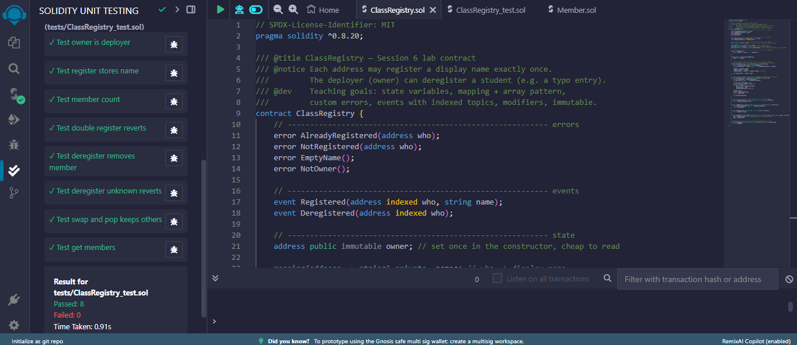
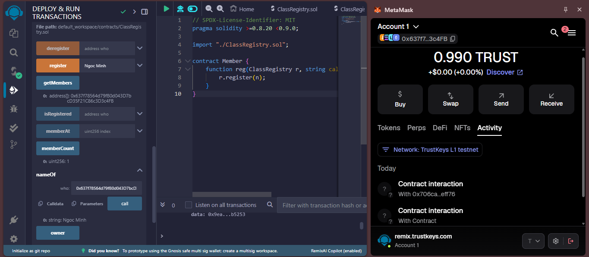

# Session 06 Homework Report — ClassRegistry (Remix)

- **Student Name:** Nguyen Ho Ngoc Minh
- **Student ID:** 11247201
- **Tools Used:** Remix IDE (`https://remix.trustkeys.com`) + MetaMask
- **Target Network:** TrustKeys L1 Testnet (Chain ID: `11968`, RPC: `https://l1testnet.trustkeys.network`)
- **Solidity Compiler:** Version `0.8.24` (EVM Version: `paris`)

---

## 1. Contract Deployment Information (TrustKeys L1 Testnet)

- **Contract Name:** `ClassRegistry`
- **Contract Address:** [`0x706ca0Bb49CA69c24a549B536ec58882d7AEFf76`](https://l1testnetscan.trustkeys.network/address/0x706ca0Bb49CA69c24a549B536ec58882d7AEFf76)
- **Deployment Transaction Hash:**  
  `0xf7eb2701c5f20d3281dda62b91414559093b0faaae84ed62584efe3268986644`

---

## 2. Unit Testing Results (Solidity Unit Testing)

Unit testing was completed using the **Solidity Unit Testing** plugin on Remix IDE, with test cases isolated in a dedicated test suite using an auxiliary contract `Member.sol` to simulate distinct callers:

- **Total Test Cases:** 8 tests (exceeding the minimum requirement of $\ge 6$ tests).
- **Result:** `8 passing` (100% success rate, 0 failures).

### List of Executed Test Cases:
1. `testOwnerIsDeployer`: Verifies that the deployer address is correctly recorded as the contract owner.
2. `testRegisterStoresName`: Tests that registering a display name stores and retrieves the string accurately.
3. `testMemberCount`: Confirms that the member counter increments correctly when multiple accounts register.
4. `testDoubleRegisterReverts`: Ensures that an address cannot register more than once (reverts with `AlreadyRegistered` as expected).
5. `testDeregisterRemovesMember`: Tests owner authorization and verification when deregistering an existing member.
6. `testDeregisterUnknownReverts`: Ensures that attempting to deregister an address that is not registered properly reverts (`NotRegistered`).
7. `testSwapAndPopKeepsOthers`: Verifies the swap-and-pop removal algorithm to ensure array density and data integrity upon member deletion.
8. `testGetMembers`: Tests the newly added `view` function to ensure it returns the complete array of registered member addresses.

### Test Execution Proof Screenshot:
*(Screenshot from the Remix Solidity Unit Testing tab showing all 8 passing tests in green)*  


---

## 3. Source Code of New `view` Function & Additional Unit Test

### 3.1. New `view` Function Added to `ClassRegistry.sol`
The `getMembers()` function allows external callers to retrieve the complete list of registered member addresses stored in the internal `_members` array:

```solidity
    /// @notice New view function: returns the complete array of registered member addresses
    function getMembers() external view returns (address[] memory) {
        return _members;
    }
```

### 3.2. Unit Test Source Code in `ClassRegistry_test.sol`
Unit test verifying the behavior and return values of `getMembers()`:

```solidity
    function testGetMembers() public {
        registry.register("A");
        m1.reg(registry, "B");
        address[] memory list = registry.getMembers();
        Assert.equal(list.length, 2, "should list 2 members");
        Assert.equal(list[0], address(this), "first is test contract");
        Assert.equal(list[1], address(m1), "second is m1");
    }
```

---

## 4. Live Interaction on TrustKeys L1 Network

- **Contract Explorer Link:** [`0x706ca0Bb49CA69c24a549B536ec58882d7AEFf76`](https://l1testnetscan.trustkeys.network/address/0x706ca0Bb49CA69c24a549B536ec58882d7AEFf76)

Following successful contract deployment to address `0x706ca0Bb49CA69c24a549B536ec58882d7AEFf76`, live contract interactions were executed via Remix IDE connected to MetaMask:

1. **Write Function (`register`):**
   - Called `register("Ngoc Minh")` using personal wallet address (`0x637f78564d79fB0d043D7bcD35F21C86c3D3c4FB`).
   - The transaction was successfully signed in MetaMask and confirmed on the TrustKeys L1 testnet.

2. **Read (`view`) Functions:**
   - **`memberCount()`:** Returned `1`, confirming that 1 member has successfully registered in the contract.
   - **`nameOf(0x637f78564d79fB0d043D7bcD35F21C86c3D3c4FB)`:** Returned `"Ngoc Minh"`, confirming that the name is correctly mapped and retrieved.
   - **`getMembers()`:** Returned `["0x637f78564d79fB0d043D7bcD35F21C86c3D3c4FB"]`, proving that the new view function properly returns the active member array from contract storage.

### Contract Interaction Proof Screenshot:
*(Screenshot showing Remix IDE contract interaction interface, return values, and MetaMask transaction confirmation on TrustKeys L1 testnet)*  

