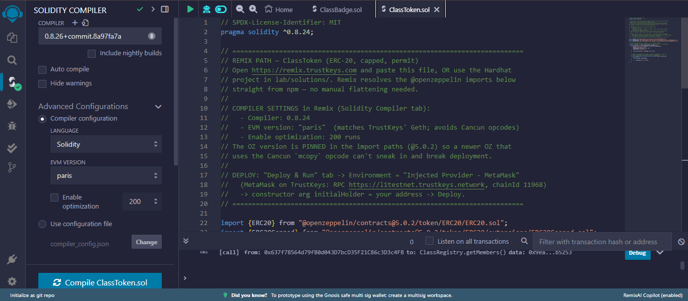
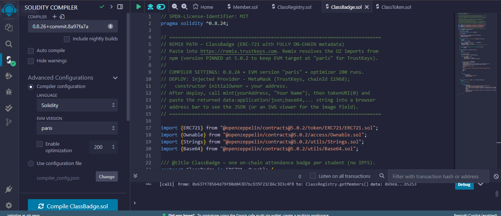
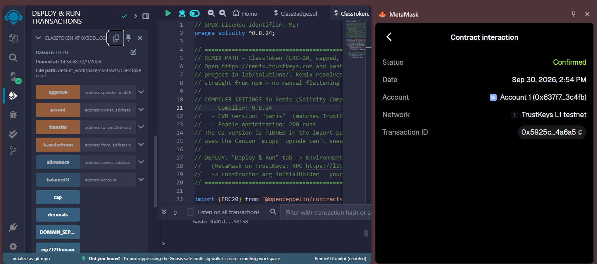
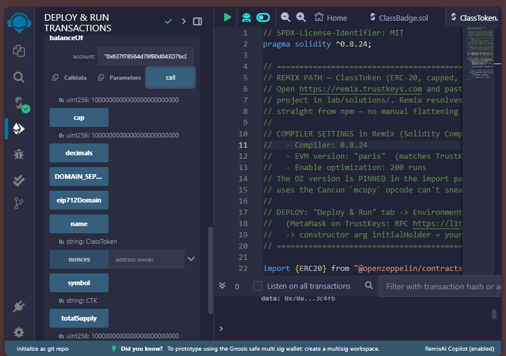
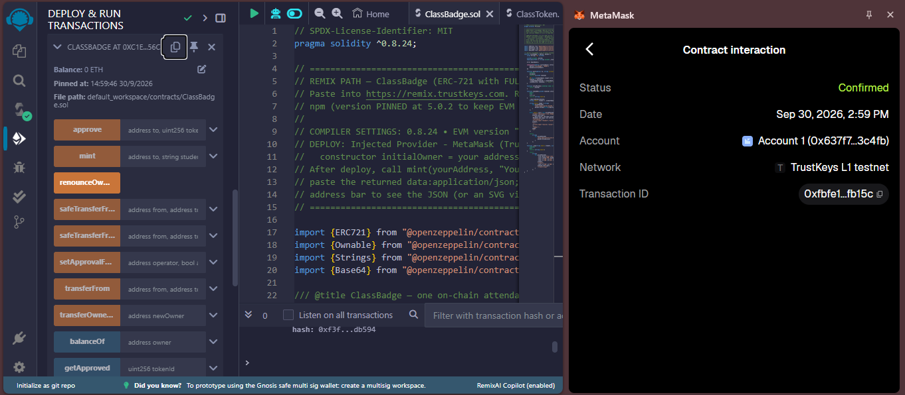
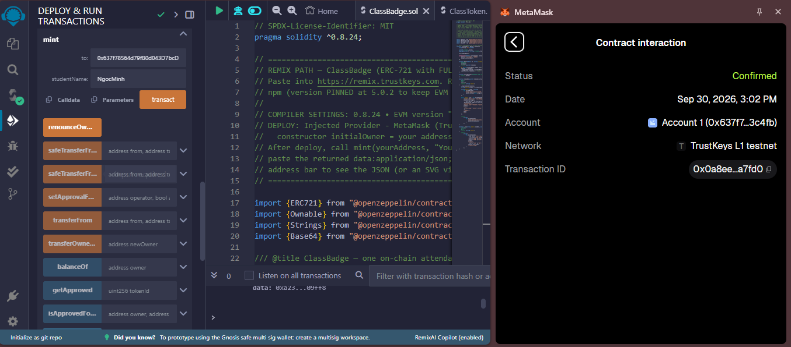
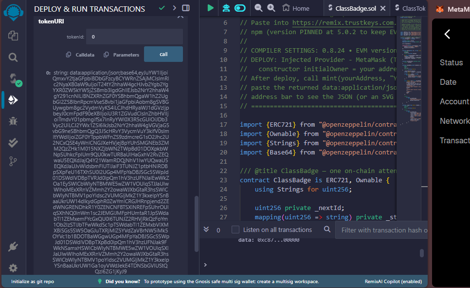
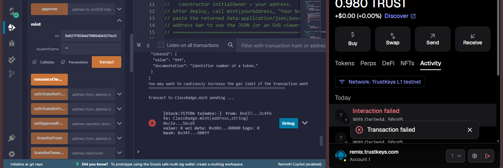
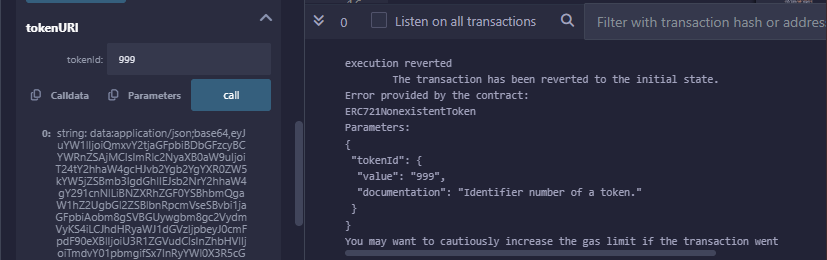

# Lab 07 Report — Token Standards (ERC-20 & ERC-721)

- **Full Name:** Nguyen Ngoc Minh
- **Student ID:** 11247201
- **Deployment Network:** TrustKeys L1 Testnet (Chain ID: `11968`, RPC: `https://l1testnet.trustkeys.network`)
- **Environment:** Remix IDE (`https://remix.trustkeys.com`) + MetaMask
- **Compiler Settings:** Solidity `0.8.24`, EVM Version: `paris`, Optimization: `200 runs`

---

## 1. On-chain Deployment Information

| Contract | Contract Address | Deploy Tx Hash | Block Explorer |
|---|---|---|---|
| **ClassToken (ERC-20)** | `0x3DDf3C365Cf853634a0dbE482102ab22699ccA19` | `0x5925cb205522a76e478203253a3bcb1e91478196a63be43eb2c2d0488384a6a5` | [View on L1Scan](https://l1testnetscan.trustkeys.network/address/0x3DDf3C365Cf853634a0dbE482102ab22699ccA19) |
| **ClassBadge (ERC-721)** | `0xC1ED4aA3dc42515C27FD1b9370eCdFd4F2C56CD5` | `0xfbfe157d091a04e09dd7f35b563bcfa6a393eec88343afd068a369a0540fb15c` | [View on L1Scan](https://l1testnetscan.trustkeys.network/address/0xC1ED4aA3dc42515C27FD1b9370eCdFd4F2C56CD5) |

---

## 2. Transfer of 100 CTK Transaction (Lab 7.3)

- **Recorded Balance After Transaction (`balanceOf`):** `100000000000000000000` wei ($100 \times 10^{18}$ smallest units, equivalent to exactly 100 CTK).

---

## 3. On-chain Metadata of ClassBadge (Token ID #0)

The string returned by the view call `tokenURI(0)` is generated and encoded on-chain as `data:application/json;base64,...`.

### Decoded JSON Metadata:

```json
{
  "name": "ClassBadge #0",
  "description": "Session 7 attendance badge",
  "attributes": [
    {
      "trait_type": "Student",
      "value": "NgocMinh"
    }
  ],
  "image": "data:image/svg+xml;base64,..."
}
```

---

## 4. Evidence (Screenshots)

### 4.1 — Compiler Settings: ClassToken (ERC-20)



*Solidity compiler configured to version `0.8.24`, EVM target `paris`, with 200 optimization runs before deploying ClassToken.*

---

### 4.2 — Compiler Settings: ClassBadge (ERC-721)



*Same compiler configuration applied to ClassBadge (ERC-721) to ensure consistency across both contracts.*

---

### 4.3 — ClassToken Deployment Transaction



*Remix IDE confirming successful deployment of ClassToken (ERC-20) on the TrustKeys L1 Testnet, showing the contract address and deploy transaction hash.*

---

### 4.4 — ClassToken View Calls & CTK Import in MetaMask



*Verifying `name()`, `symbol()`, `decimals()`, and `totalSupply()` view functions; CTK token successfully imported into MetaMask.*

---

### 4.5 — ClassBadge Deployment Transaction



*Remix IDE confirming successful deployment of ClassBadge (ERC-721) on the TrustKeys L1 Testnet.*

---

### 4.6 — Minting ClassBadge Token ID #0



*Calling `safeMint()` on ClassBadge to mint Token ID #0 to the student's wallet address. Transaction confirmed on-chain.*

---

### 4.7 — `tokenURI(0)` Raw Output



*The raw `data:application/json;base64,...` string returned by `tokenURI(0)`, fully generated and stored on-chain.*

---

### 4.8 — Decoded JSON Metadata


*The Base64-decoded JSON metadata for ClassBadge Token ID #0, showing the `name`, `description`, `attributes`, and `image` fields.*

---

### 4.9 — On-chain SVG Image


*The SVG graphic embedded inside the NFT metadata, rendered directly from on-chain data without any off-chain dependency.*

---

### 4.10 — Revert Case: Access Control Check



*Demonstrating the contract's access control: a transaction attempting to call `safeMint()` from a non-owner address is correctly reverted by the `onlyOwner` modifier.*

---

### 4.11 — Transfer Screenshot



*MetaMask or L1Scan confirmation of the 100 CTK transfer transaction (Lab 7.3).*

---

## 5. Theoretical Questions (Q1 — Q7)

### Q1. Why do we build on top of OpenZeppelin instead of writing ERC-20 from scratch?

OpenZeppelin Contracts provides industry-standard template libraries that have undergone multiple rigorous security audits, have been battle-tested protecting billions of USD worth of assets on mainnet, and are continuously gas-optimized.

Writing an ERC-20 from scratch is highly error-prone and can easily introduce critical logic vulnerabilities such as:
- Incorrect balance accounting
- Flawed permission control in `transferFrom`
- Improper `Transfer`/`Approval` event emission
- Non-compliance with the full EIP-20 specification

---

### Q2. `decimals()` returns 18. If Alice's balance is `1000000000000000000`, how many CTK is that — and where does the number 18 actually live: on-chain or in the UI?

`1000000000000000000` smallest units (token wei) equals exactly **1 CTK**.

The EVM does not store floating-point numbers on-chain — it only operates on non-negative integers. The number `18` is purely a metadata value declared on-chain for UI layers (MetaMask, DApp frontends, exchanges) to read and automatically apply a $\div 10^{18}$ conversion so that human-readable decimal numbers are displayed.

**In short:** The integer arithmetic lives on-chain; the decimal *display* lives in the UI.

---

### Q3. Why does a DEX need the `approve + transferFrom` pattern instead of just `transfer`? What is the risk of granting an unlimited allowance `approve(spender, 2^256 - 1)`?

A plain `transfer` only pushes tokens to a recipient address and cannot trigger the DEX smart contract's logic within the same transaction. The `approve + transferFrom` pattern allows a user to pre-authorize a spending limit, after which the DEX contract can atomically pull the exact token amount from the user's wallet into the liquidity pool and return the swapped tokens — all in a single atomic transaction.

**Risk of unlimited approval (`2^256 - 1`):** If the DEX contract ever develops a security vulnerability, is exploited, or has malicious logic introduced through an upgrade, an attacker can drain the user's entire current and future token balance without requiring any further approval from the user.

---

### Q4. Where do the JSON metadata and the ClassBadge NFT image actually live? What problem did we avoid by NOT using IPFS on TrustKeys?

The entire JSON metadata string and the SVG vector graphic are stored and generated directly **on-chain** — dynamically constructed from a template inside the contract's bytecode and Base64-encoded at the moment a user calls `tokenURI()`.

By not using IPFS, we eliminate:
- Dependency on off-chain infrastructure
- Risk of broken links (404 errors) if IPFS nodes unpin the data
- Cost of running pinning services
- Gateway resolution latency

The NFT metadata is therefore **permanent and fully decentralized** without any external dependency.

---

### Q5. *(To be completed)*

---

### Q6. *(To be completed)*

---

### Q7. *(To be completed)*
