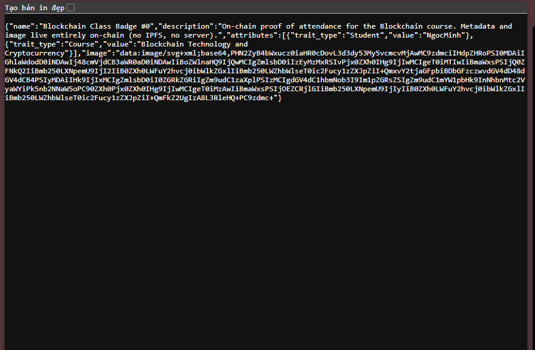
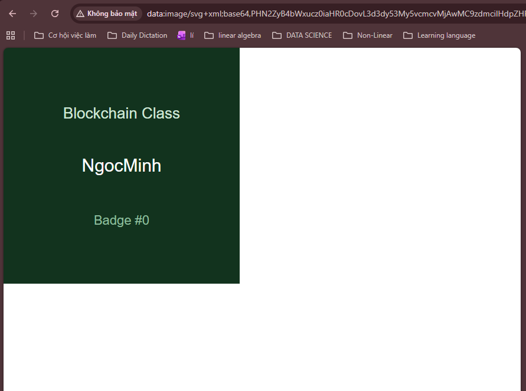

# Lab 07 — Token Standards (ERC-20 + ERC-721) trên TrustKeys: Việc cần làm

**Mạng:** TrustKeys L1 testnet — RPC `https://l1testnet.trustkeys.network`, chainId `11968` (không có explorer)
**Bạn đã có:** `ClassToken_remix.sol` (ERC-20) và `ClassBadge_remix.sol` (ERC-721), là bản một tệp cho đường Remix.

## Điều kiện đạt (theo đề)

1. `npx hardhat test` xanh toàn bộ (đường Hardhat)
2. Đã deploy **cả hai** hợp đồng lên TrustKeys
3. Nhập **ClassToken** vào MetaMask và cho trợ giảng xem giao dịch chuyển **100 CTK**
4. Giải mã `tokenURI` của **ClassBadge** và cho trợ giảng xem

## Cần nộp / cần có

| # | Việc | Sản phẩm |
|---|---|---|
| A | Deploy ClassToken | địa chỉ hợp đồng + tx hash |
| B | Deploy ClassBadge | địa chỉ hợp đồng + tx hash |
| C | Nhập CTK vào MetaMask, chuyển 100 CTK cho bạn cùng lớp | tx hash + `balanceOf` của người nhận |
| D | Mint 1 badge, giải mã `tokenURI(0)` | JSON + SVG đã giải mã |
| E | Trả lời Q1–Q6 (Q7 là bonus) | văn bản |
| F | Test (xem mục 5) | kết quả test |

> **Cách nộp:** một file `lab07_<ten>.md` kèm thư mục `image/` chứa ảnh chụp màn hình (mẫu ở mục 8). Có minh chứng nào thì nộp minh chứng đó.
> Hỏi giảng viên: nơi nộp, và **đường Remix có được chấp nhận** cho phần test không (đề gốc yêu cầu `npx hardhat test`).

---

## 0. Chuẩn bị

- [ ] MetaMask đã có mạng TrustKeys L1 (chainId 11968)
- [ ] Dùng **tài khoản MetaMask thử riêng**, tuyệt đối không dùng mnemonic hoặc khóa ví thật
- [ ] Tài khoản thử đã được **giảng viên nạp coin** (cần để trả gas)
- [ ] Đã mở `https://remix.trustkeys.com`

---

## 1. Cài đặt compiler trên Remix (rất quan trọng)

Cả hai file đều yêu cầu cấu hình này, nếu sai thì deploy có thể lỗi:

| Cài đặt | Giá trị |
|---|---|
| Compiler | **0.8.24** |
| EVM version | **paris** (TrustKeys chạy Geth target paris) |
| Optimization | bật, **200 runs** |

**Lý do:** OpenZeppelin bản mới dùng opcode Cancun `mcopy`, mà TrustKeys không hỗ trợ. Vì vậy các import trong file đã ghim `@5.0.2` (`@openzeppelin/contracts@5.0.2/...`). Đừng xóa phần `@5.0.2` khỏi đường dẫn import.

- [ ] Tab **Solidity Compiler**: chọn 0.8.24 → mở *Advanced Configurations* → EVM Version = `paris`, bật optimization 200
- [ ] Tạo 2 file trong Remix: `ClassToken.sol` (dán nội dung `ClassToken_remix.sol`) và `ClassBadge.sol` (dán nội dung `ClassBadge_remix.sol`)
- [ ] Compile cả hai, không lỗi (Remix tự tải thư viện OpenZeppelin từ npm)

---

## 2. Lab 7.1 — ClassToken (ERC-20)

File của bạn đã có đủ yêu cầu của đề: kế thừa `ERC20`, `ERC20Capped`, `ERC20Permit`; name `ClassToken`, symbol `CTK`, cap 1.000.000 × 10¹⁸; constructor mint toàn bộ cap cho `initialHolder`; override `_update(...)` với `override(ERC20, ERC20Capped)`.

**Deploy (tab Deploy & Run Transactions):**
- [ ] Environment = *Injected Provider – MetaMask*, MetaMask ở mạng TrustKeys, đúng tài khoản thử
- [ ] Contract = `ClassToken`
- [ ] Constructor arg `initialHolder` = **địa chỉ ví của bạn** (toàn bộ 1.000.000 CTK sẽ về ví này)
- [ ] Deploy → xác nhận MetaMask
- [ ] **Lưu địa chỉ ClassToken** và **tx hash deploy** (terminal Remix hoặc tab Activity của MetaMask)

**Thử các hàm trên Remix:**
- [ ] `name()`, `symbol()`, `decimals()` (ra 18), `cap()`, `totalSupply()`
- [ ] `balanceOf(<ví của bạn>)` bằng đúng `cap()` / `totalSupply()`

---

## 3. Lab 7.2 — ClassBadge (ERC-721, metadata on-chain)

File của bạn đã có: `ERC721 + Ownable`, `mint(to, studentName)` chỉ owner, dùng `_safeMint`, `tokenURI` dựng `data:application/json;base64,...` on-chain (JSON có `name`, `description`, `attributes` với trait `Student`, và `image` là SVG base64), lỗi `EmptyName`, token chưa mint → `ERC721NonexistentToken` (từ `_requireOwned`).

**Deploy:**
- [ ] Contract = `ClassBadge`
- [ ] Constructor arg `initialOwner` = **địa chỉ ví của bạn**
- [ ] Deploy → xác nhận MetaMask
- [ ] **Lưu địa chỉ ClassBadge** và **tx hash deploy**

**Mint và giải mã:**
- [ ] Gọi `mint(<ví của bạn>, "Tên của bạn")` → nên **không dùng dấu nháy kép `"` trong tên** vì JSON dựng thủ công, sẽ hỏng
- [ ] Gọi `totalMinted()` → ra 1
- [ ] Gọi `tokenURI(0)` → copy chuỗi trả về (`data:application/json;base64,...`)
- [ ] Dán chuỗi đó vào **thanh địa chỉ trình duyệt** để xem JSON, hoặc decode base64 phần sau dấu phẩy
- [ ] Trong JSON, copy giá trị `image` (là `data:image/svg+xml;base64,...`) dán vào thanh địa chỉ để xem ảnh SVG
- [ ] Chụp lại JSON + ảnh SVG để cho trợ giảng xem
- [ ] Thử `tokenURI(999)` → phải revert (token chưa tồn tại)
- [ ] Thử `mint(<ví>, "")` → phải revert `EmptyName`

---

## 4. Lab 7.3 — Nhập CTK vào MetaMask và chuyển 100 CTK

1. [ ] MetaMask → **Import tokens** → dán địa chỉ ClassToken (symbol `CTK`, decimals `18`) → thấy số dư 1.000.000 CTK
2. [ ] Xin địa chỉ ví của một bạn cùng lớp (hoặc dùng ví thứ hai của chính bạn)
3. [ ] Chuyển **100 CTK** bằng một trong hai cách:
   - Trong MetaMask: chọn CTK → Send → nhập 100, hoặc
   - Trên Remix: gọi `transfer(<địa chỉ nhận>, 100000000000000000000)` (100 × 10¹⁸, tức số 1 theo sau 20 chữ số 0)
4. [ ] **Xác nhận (Q6):** gọi `balanceOf(<địa chỉ nhận>)` trên Remix → ra `100000000000000000000`; kiểm tra thêm bằng MetaMask của người nhận
5. [ ] Lưu **tx hash** của giao dịch chuyển

---

## 5. Test (điều kiện đạt: xanh toàn bộ)

Đề yêu cầu test bằng Hardhat + Chai. Nếu giảng viên bắt buộc đường này, làm theo mục 5A. Nếu chấp nhận Remix, xem 5B.

### 5A. Đường Hardhat (theo đề)

```bash
mkdir tokens && cd tokens
npm init -y
npm i --save-dev hardhat @nomicfoundation/hardhat-toolbox dotenv
npm i @openzeppelin/contracts@5.0.2
npx hardhat init        # chọn JavaScript project
```

- [ ] `hardhat.config.js`: `solidity: { version: "0.8.24", settings: { optimizer: { enabled: true, runs: 200 } } }` và **`evmVersion: "paris"`**, thêm mạng `trustkeys` (url `https://l1testnet.trustkeys.network`, chainId 11968, accounts từ `.env`)
- [ ] Chép hai hợp đồng vào `contracts/`, **đổi import**: bỏ `@5.0.2` khỏi đường dẫn (ví dụ `@openzeppelin/contracts/token/ERC20/ERC20.sol`), vì Hardhat đã ghim phiên bản qua `npm i`
- [ ] Các script `deploy-token.js`, `deploy-badge.js`, `interact-token.js`, `read-badge.js` nằm trong `lab/solutions/` của giảng viên (bạn chưa có), nên hãy lấy từ đó hoặc tự viết

**`test/ClassToken.test.js` cần ít nhất:**
- [ ] name/symbol/decimals; `cap() == totalSupply() ==` số dư của deployer
- [ ] `transfer` chuyển số dư và emit `Transfer`
- [ ] chuyển vượt số dư → revert `ERC20InsufficientBalance`
- [ ] `approve` → `transferFrom` bởi spender; `allowance` giảm
- [ ] vòng lặp qua một danh sách số tiền: số dư người nhận bằng tổng lũy kế, `totalSupply()` không đổi (bất biến bảo toàn cung)

**`test/ClassBadge.test.js` cần ít nhất:**
- [ ] `mint` chỉ owner (người khác → `OwnableUnauthorizedAccount`)
- [ ] `tokenURI(0)`: giải mã base64 bằng JS rồi kiểm tra các trường JSON

```js
const uri = await badge.tokenURI(0);
const json = Buffer.from(uri.split(",")[1], "base64").toString("utf8");
const meta = JSON.parse(json);
expect(meta.attributes.find(a => a.trait_type === "Student").value).to.equal("...");
```

- [ ] tên rỗng → `EmptyName`; token chưa mint → `ERC721NonexistentToken`
- [ ] `npx hardhat test` xanh toàn bộ (giải pháp tham khảo của giảng viên có 14 test)

### 5B. Đường Remix

- [ ] Dùng plugin **Solidity Unit Testing** (như bài Lab 6) để viết các test tương ứng bằng Solidity, hoặc tự thử tay từng hàm trên UI Remix
- [ ] Hỏi giảng viên có chấp nhận không

---

## 6. Câu hỏi Q1–Q6 (Q7 là bonus)

Viết bằng lời của bạn. Gợi ý hướng trả lời:

- **Q1.** Vì sao dùng OpenZeppelin thay vì tự viết ERC-20? → mã đã kiểm toán, nhiều người dùng thực tế, được xem xét gas, ít bề mặt lỗi hơn.
- **Q2.** `decimals()` = 18; số dư `1000000000000000000` là bao nhiêu CTK, và số 18 nằm ở đâu? → là 1 CTK; on-chain chỉ có số nguyên (đơn vị nhỏ nhất), "18" chỉ là metadata để giao diện hiển thị.
- **Q3.** Vì sao DEX cần `approve` + `transferFrom` thay vì `transfer`? Rủi ro của `approve(spender, 2²⁵⁶−1)`? → `transfer` thường không chạy code bên nhận nên hợp đồng không phản ứng được; `transferFrom` cho hợp đồng tự kéo token trong giao dịch của nó. Infinite approval: nếu spender bị hack hoặc độc hại thì mất toàn bộ số dư.
- **Q4.** JSON và ảnh sống ở đâu? Tránh được gì khi không dùng IPFS? → nằm ngay trong hợp đồng (code/storage), dựng lúc gọi `tokenURI`; tránh phải pin file và phụ thuộc dịch vụ bên ngoài (link chết).
- **Q5.** Chữ "safe" trong `_safeMint`/`safeTransferFrom` kiểm tra gì? → nếu người nhận là hợp đồng, kiểm tra nó cài `onERC721Received`; để NFT không bị kẹt trong hợp đồng không biết cách di chuyển nó.
- **Q6.** Không có explorer, bạn xác nhận chuyển 100 CTK bằng cách nào? → gọi view `balanceOf` (bằng Remix/ethers) và xem số dư trong MetaMask, có thể đọc thêm event log `Transfer`.
- **Q7 (bonus).** Điều gì chặn replay chữ ký `permit`? → chữ ký gắn với chainId, địa chỉ hợp đồng, nonce của owner và deadline.

---

## 7. Bonus — Lab 7.4: `permit` (EIP-2612)

`ClassToken` đã kế thừa `ERC20Permit`, nên hợp đồng đã sẵn sàng. Phần bonus cần script ethers (ký `signTypedData` off-chain rồi gửi `permit(...)` từ tài khoản thứ hai), làm được bằng Hardhat.

- [ ] Kiểm tra `allowance` được đặt và `nonces(owner)` tăng
- [ ] Test: deadline hết hạn → revert `ERC2612ExpiredSignature`
- [ ] Trả lời Q7

---

## 8. Cấu trúc bài nộp

```
lab07_<ten>/
├── lab07_<ten>.md
└── image/
    ├── 01-compiler-settings.png
    ├── 02-token-deployed.png
    ├── 03-token-view-calls.png
    ├── 04-badge-deployed.png
    ├── 05-badge-mint-tokenuri.png
    ├── 06-badge-json-decoded.png
    ├── 07-badge-svg.png
    ├── 08-metamask-import-ctk.png
    ├── 09-transfer-100ctk.png
    ├── 10-balanceof-recipient.png
    ├── 11-badge-revert-cases.png
    └── 12-tests.png
```

**Ảnh cần chụp (chỉ nộp cái nào bạn thật sự làm):**

| Ảnh | Nội dung phải thấy rõ |
|---|---|
| 01 | Compiler 0.8.24, EVM `paris`, optimizer 200 |
| 02 | ClassToken trong *Deployed Contracts* + terminal có tx hash deploy |
| 03 | `name`, `symbol`, `decimals`, `cap`, `totalSupply`, `balanceOf(ví bạn)` |
| 04 | ClassBadge đã deploy + tx hash |
| 05 | Giao dịch `mint` và kết quả `tokenURI(0)` |
| 06 | JSON đã giải mã (mở data URI trong trình duyệt) |
| 07 | Ảnh SVG từ trường `image` |
| 08 | MetaMask đã import CTK, thấy số dư |
| 09 | Giao dịch chuyển 100 CTK (MetaMask Activity hoặc terminal Remix có tx hash) |
| 10 | `balanceOf(người nhận)` = `100000000000000000000` |
| 11 | `mint` tên rỗng → `EmptyName`; `tokenURI(999)` → revert |
| 12 | Kết quả test (nếu có) |

> **Bảo mật:** không để lộ private key, mnemonic hoặc nội dung file `.env` trong ảnh. Che lại nếu lỡ hiện ra.

**Mẫu `lab07_<ten>.md`:**

````markdown
# Lab 07 — <Họ tên> — <MSSV>

## 1. Thông tin triển khai
| Hợp đồng | Địa chỉ | Tx hash deploy |
|---|---|---|
| ClassToken | 0x... | 0x... |
| ClassBadge | 0x... | 0x... |

Cách làm: Remix (0.8.24, paris, optimizer 200) / Hardhat (ghi rõ đường bạn dùng)

## 2. Minh chứng
### ClassToken


### Chuyển 100 CTK
- Người nhận: 0x...
- Tx hash: 0x...


### ClassBadge




### Test


## 3. Trả lời câu hỏi
### Q1 ...
### Q2 ...
### Q3 ...
### Q4 ...
### Q5 ...
### Q6 ...
### Q7 (bonus, nếu làm) ...
````

---

## 9. Link GitHub của OpenZeppelin (thầy gửi để làm gì)

`https://github.com/openzeppelin/openzeppelin-contracts` là **mã nguồn của thư viện OpenZeppelin Contracts**, chính là thư viện hai hợp đồng của bạn `import` (`ERC20`, `ERC20Capped`, `ERC20Permit`, `ERC721`, `Ownable`, `Strings`, `Base64`).

Thầy gửi link này để bạn:
- **Đọc mã nguồn thật** của các hợp đồng mình kế thừa, để hiểu chúng làm gì bên trong, vì khi vấn đáp có thể bị hỏi (ví dụ `_update` trong `ERC20` và `ERC20Capped`, hoặc `_safeMint` gọi `onERC721Received` ra sao). Nó giúp trả lời Q1, Q2, Q5.
- **Hiểu vì sao phải ghim `5.0.2`:** vào repo chọn đúng tag/phiên bản **v5.0.2** để xem đúng bản mình dùng, không phải bản mới nhất (bản mới dùng opcode `mcopy` không chạy trên TrustKeys).
- **Biết đường dẫn import:** đường `@openzeppelin/contracts@5.0.2/token/ERC20/ERC20.sol` tương ứng thư mục `contracts/token/ERC20/ERC20.sol` trong repo (tương tự cho `ERC721`, `access/Ownable.sol`, `utils/Base64.sol`).
- **Xem các extension khác** (Votes, Pausable, ERC1155...) để dùng cho đồ án sau này.

Bạn không cần tải hay cài gì từ link đó cho lab này (Remix tự lấy từ npm, Hardhat lấy qua `npm i`). Chỉ cần mở ra đọc.

---

## Checklist cuối

- [ ] Địa chỉ + tx hash deploy **ClassToken**
- [ ] Địa chỉ + tx hash deploy **ClassBadge**
- [ ] Tx hash chuyển 100 CTK + `balanceOf` người nhận
- [ ] JSON + SVG đã giải mã từ `tokenURI(0)`
- [ ] Kết quả test
- [ ] Q1–Q6 đã viết (Q7 nếu làm bonus)
- [ ] Thư mục `image/` có đủ ảnh và link trong file md đúng tên
- [ ] Ảnh không lộ private key / mnemonic
- [ ] Đã hỏi giảng viên nơi nộp và việc chấp nhận đường Remix
